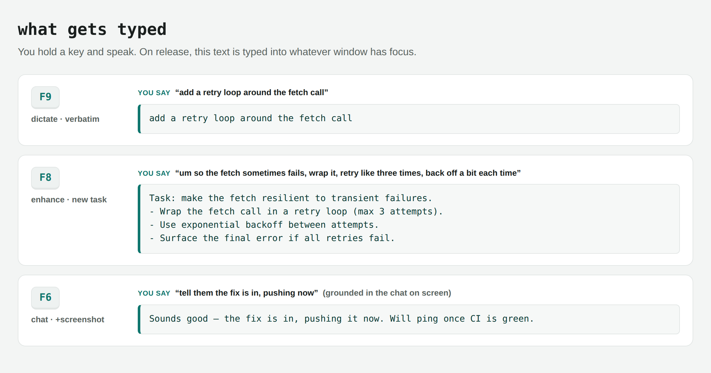
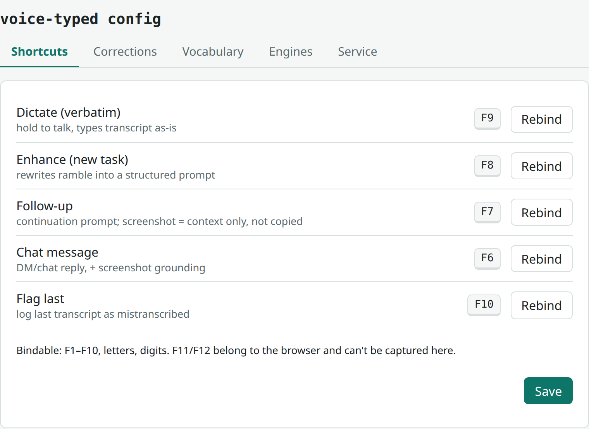
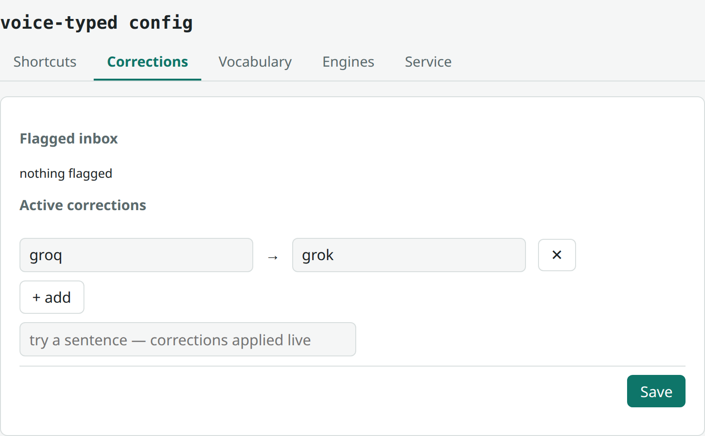
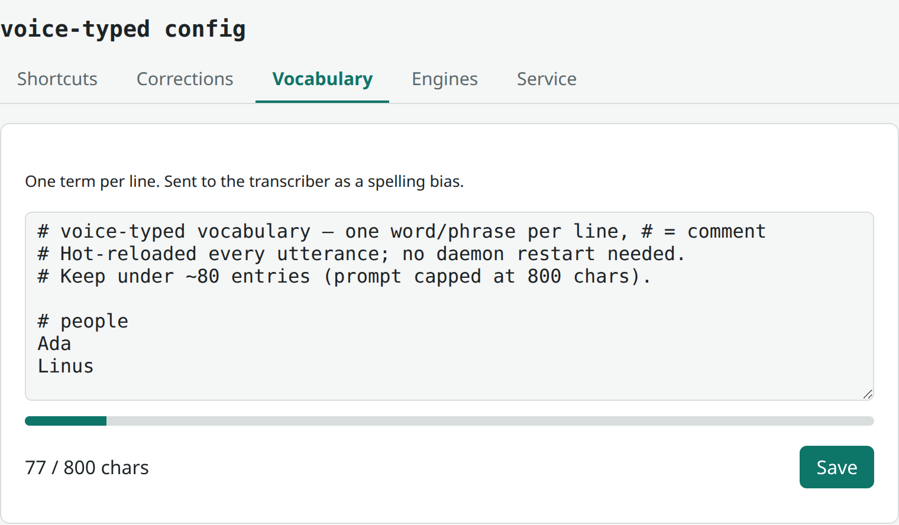
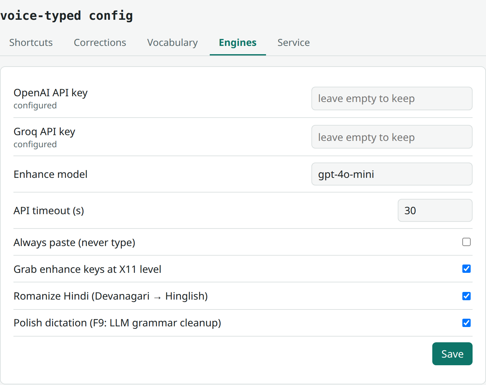
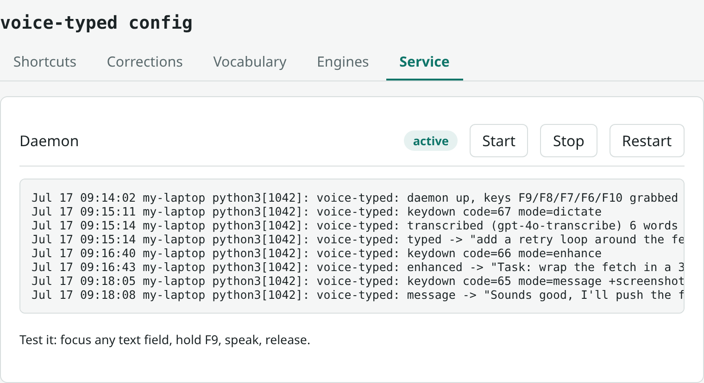

# voice-typed

[](https://github.com/saurabhrkp-fiftyfive/voice-typed/actions/workflows/ci.yml)
[](LICENSE)
[](https://www.python.org/)
[](#getting-started)
[](#)

**Hold-to-talk voice dictation daemon for X11 / GNOME.** Hold a key, speak,
release → your speech is transcribed (and optionally rewritten by an LLM,
grounded in a screenshot of the active window) and typed into the focused
window via `xdotool`.

No always-on listening. No wake word. No standing transcript log. Audio is
recorded only while a key is held, transcribed once, then deleted.

## What gets typed



Same voice, three keys. **F9** types what you said, verbatim. **F8** rewrites a
ramble into a structured task prompt. **F6** turns an aside into a chat reply,
grounded in what's on screen. Every mode types straight into the focused window
— editor, terminal, chat box, anywhere. Pick a key per [mode](#keys--modes),
tune everything from the [config panel](#web-config-panel).

---

## Keys / modes

| Key | Env var | Mode | LLM rewrite | Screenshot | System prompt |
|-----|---------|------|-------------|-----------|---------------|
| **F9** | `VOICE_TYPED_KEY` | verbatim | opt-in | no | types transcript as-is; `behavior.polish_dictation = true` adds a light grammar/phrasing cleanup (`POLISH_SYSTEM`) |
| **F8** | `VOICE_TYPED_ENHANCE_KEY` | new-task enhance | yes | no | `ENHANCE_SYSTEM` — rewrites ramble into a structured coding-agent prompt |
| **F7** | `VOICE_TYPED_FOLLOWUP_KEY` | follow-up enhance | yes | **yes** | `FOLLOWUP_SYSTEM` (+ grounding line) — continuation message for an active agent session; the screenshot is READ-ONLY context to shape a grounded follow-up, never copied/answered as output |
| **F6** | `VOICE_TYPED_MSG_KEY` | chat message | yes | **yes** | `MSG_SYSTEM` — natural chat/DM reply grounded in on-screen thread |
| **F10** | `VOICE_TYPED_FLAG_KEY` | flag last | no | no | appends last utterance to `flagged.md` |

`SCREENSHOT_MODES = {"followup", "message"}` gates capture. F8/F9 never capture
(F8 is a new-task start point — screen is usually blank; F9 is raw dictation).
For F7 the screenshot is grounding context only: the grounding line tells the
model to build the follow-up from the dictation and never reproduce the
on-screen chat's output.

---

## API models & how they connect

Two independent OpenAI-compatible pipelines, each with a Groq fallback. Keys
read from `~/.config/secrets.env` (`OPENAI_API_KEY`, `GROQ_API_KEY`).

### 1. Speech-to-text (all modes)

```
WAV (16 kHz mono, pw-record)
  → OpenAI  POST /v1/audio/transcriptions   model gpt-4o-transcribe   [primary]
  → Groq    POST /v1/audio/transcriptions   model whisper-large-v3    [fallback]
```

- First engine with a configured key is tried; on any error the next engine
  runs. If all fail → notify + skip (nothing typed).
- **vocab bias:** `vocab.txt` (domain words / names) is sent as the STT `prompt`
  parameter to bias spelling. Hot-reloaded per utterance, capped ~800 chars.
- **Hindi -> Roman (all modes):** after transcription, any Devanagari in the
  text is transliterated to natural Roman Hindi (Hinglish) via the enhance chat
  model — e.g. `क्या हाल है` -> `kya haal hai`. Gated on a Devanagari check, so
  English-only dictation makes no extra call. Latin text, numbers, code, and
  English words pass through unchanged; on any API failure the original text is
  kept. Runs before enhance, so F6/F7/F8 also get Roman input.

### 2. Prompt/message enhance (F6, F7, F8 only)

```
transcript (+ optional screenshot)
  → OpenAI  POST /v1/chat/completions   model gpt-4o-mini   [primary, vision-capable]
  → Groq    POST /v1/chat/completions   model llama-3.3-70b-versatile   [fallback, TEXT-ONLY]
temperature 0.3
```

- Model overridable via `VOICE_TYPED_ENHANCE_MODEL` (default `gpt-4o-mini`).
- **Vision:** when a screenshot is present, the OpenAI request sends a vision
  content array — `[{type:text, text:<transcript>}, {type:image_url, image_url:{url:"data:image/png;base64,…"}}]`.
  The Groq fallback is text-only (llama-3.3-70b has no vision) and silently
  drops the image, so the worst case equals plain text enhance.
- **Spelling guard:** the `vocab.txt` terms are appended to the enhance system
  prompt ("Preserve the EXACT spelling of these names/terms…") so the LLM does
  not re-spell names during the rewrite.
- **Correction safety net:** `corrections.txt` (`wrong => right`) is applied
  deterministically **after** the LLM rewrite too — the LLM cannot reintroduce a
  known misspelling.
- On enhance failure the **raw (already corrected) transcript** is typed — text
  is never lost.

---

## Screenshot / vision pipeline (F6 & F7)

Captured at **keydown**, after the recorder starts (so audio isn't delayed):

```
xdotool getactivewindow                         → window id
xdotool getwindowgeometry --shell <id>          → X Y WIDTH HEIGHT
ffmpeg -f x11grab -video_size WxH -i :D+X,Y ...  → active-window PNG
Pillow thumbnail → longest side SHOT_MAX_PX (1568 px)  → re-saved PNG
```

- **Active window only** (not full screen) — less noise, fewer tokens, more
  privacy.
- **Best-effort:** any failure (geometry, ffmpeg, PIL) logs and returns `None`;
  the mode degrades to text-only enhance. The daemon never crashes on a
  screenshot error.
- The PNG is deleted immediately after use (in `handle_utterance`'s `finally`,
  alongside the WAV).
- 1568 px keeps on-screen text (chat threads, terminal output) legible to the
  vision model.

**Privacy/cost note:** on F6/F7 a screenshot of the active window leaves the
machine (sent to OpenAI). Cheap on `gpt-4o-mini`, deleted locally right after.

---

## Data flow

```
F6/F7 keydown
  → start_recording(wav)
  → capture_active_window(png)          # only if mode in SCREENSHOT_MODES
keyup (or MAX_UTTERANCE cap)
  → queue.put((wav, active_window_id, mode, png))
worker thread
  → transcribe(wav)                     # STT chain
  → apply_corrections(text)             # deterministic, pre-enhance
  → enhance_prompt(text, mode, image_path=png)   # LLM (+vision) chain
  → apply_corrections(text)             # deterministic, post-enhance
  → focus guard (drop if active window changed since keydown)
  → inject(text)                        # xdotool type, or clipboard paste for enhanced/multi-line
  finally → unlink wav + png
```

---

## Configuration

Settings live in `~/.config/voice-typed/config.toml` (created by the installer;
optional — absent file = these defaults):

```toml
[keys]
dictate  = "KEY_F9"
enhance  = "KEY_F8"
followup = "KEY_F7"
message  = "KEY_F6"
flag     = "KEY_F10"

[engines]
enhance_model = "gpt-4o-mini"
api_timeout_s = 30
stt_url = ""      # custom/local OpenAI-compatible STT endpoint (tried first)
stt_model = ""    # model name for that endpoint (default whisper-1)

[behavior]
paste_mode = false
grab_keys = true
max_utterance_s = 300
transliterate_devanagari = true
polish_dictation = false   # F9: LLM grammar/phrasing cleanup instead of verbatim
min_utterance_s = 0.4      # shorter hold = accidental tap, never transcribed
silence_rms = 30           # s16 RMS below this = muted/dead input
speech_dynamics = 2.2      # p90/p10 of window RMS below this = noise, not speech
```

`polish_dictation = true` sends F9 dictation through a light LLM pass (the
enhance chat model) that fixes grammar and smooths phrasing without changing
meaning or adding content — unlike F8, it never restructures into a task
prompt. On API failure the raw transcript is typed; text is never lost.

### Silence gating

A stray keypress used to cost real text: the recording reached the STT API,
which answers silence with a canned hallucination ("Thank you.", "Thanks for
watching!"), and on F7/F8 that fragment was then expanded — using the
screenshot — into a plausible, entirely invented instruction. Four gates now
stand in the way, and the first three run *before* any API call:

1. `min_utterance_s` — a tap shorter than this is dropped.
2. `silence_rms` — a muted or dead input is dropped.
3. `speech_dynamics` — loudness alone can't spot room noise (a laptop mic can
   idle at RMS ~1500), so the check is structural: `p90/p10` of per-window RMS.
   Speech alternates syllables with gaps and scores well above the floor, while
   a fan or street hum is stationary and sits near 1.
4. A canned-phrase filter on the transcript, plus a `NO_SPEECH` sentinel the
   enhance model returns instead of inventing content when the dictation is
   empty.

Each gate notifies why nothing was typed, so a silent drop is never a mystery.
Thresholds are mic- and room-dependent — measure yours instead of trusting the
defaults:

```bash
voice-typed calibrate   # samples silence then speech, suggests speech_dynamics
```

Key-binding changes need `voice-typed restart`; everything else is picked up
per utterance.

### Web config panel

```bash
voice-typed config               # opens the panel in your browser
voice-typed config --no-browser  # print the URL only (SSH: forward the port)
```

Runs a short-lived local web server and opens a five-tab panel:

- **Shortcuts** — rebind any mode key by pressing it (F1–F10, A–Z, 0–9);
  conflicts are detected before save.

  

- **Corrections** — the F10 flag inbox: promote a bad transcript to a
  `wrong => right` pair, add words to vocabulary, or dismiss; edit the
  corrections table with a live preview.

  

- **Vocabulary** — edit `vocab.txt` with a prompt-budget bar.

  

- **Engines** — API keys (write-only fields, never displayed back), enhance
  model, timeout, behavior toggles.

  

- **Service** — daemon status, start/stop/restart, recent log.

  

Security: binds to `127.0.0.1` only; every request needs a per-session random
token (in the URL it prints); Host/Origin are checked against loopback; the
server exits after 15 min idle. API keys are written to `secrets.env` (0600)
and never echoed to the browser or logs.

### User files (hot-reloaded every utterance)

| File | Purpose |
|------|---------|
| `~/.config/voice-typed/vocab.txt` | Domain words / names, one per line (`#` comments). STT spelling bias **and** enhance spelling guard. Cap ~80 entries / 800 chars. |
| `~/.config/voice-typed/corrections.txt` | `wrong => right` pairs, `#` comments. Deterministic post-STT + post-enhance replace (case-insensitive, word-boundary). |
| `~/.local/share/voice-typed/flagged.md` | F10 log of bad transcripts for later correction. `flagged.md.template` shows the format. |
| `~/.config/voice-typed/secrets.env` | `OPENAI_API_KEY` / `GROQ_API_KEY` (`KEY=value` lines, 0600). Legacy fallback: `~/.config/secrets.env`. |

On first run, existing repo-dir `vocab.txt` / `corrections.txt` / `flagged.md`
are **copied** to the paths above (one-time migration; XDG copies win from then
on).

### Environment variables (legacy — override config.toml)

| Var | Default | Meaning |
|-----|---------|---------|
| `VOICE_TYPED_KEY` | `KEY_F9` | verbatim dictation key (evdev name) |
| `VOICE_TYPED_ENHANCE_KEY` | `KEY_F8` | new-task enhance key |
| `VOICE_TYPED_FOLLOWUP_KEY` | `KEY_F7` | follow-up enhance key (+screenshot context) |
| `VOICE_TYPED_MSG_KEY` | `KEY_F6` | chat-message key (+screenshot) |
| `VOICE_TYPED_FLAG_KEY` | `KEY_F10` | flag-last key |
| `VOICE_TYPED_ENHANCE_MODEL` | `gpt-4o-mini` | enhance model override |
| `VOICE_TYPED_PASTE` | unset | `1` = always clipboard-paste instead of typing |
| `VOICE_TYPED_GRAB` | `1` | `0` disables X11 key-grab (enhance keys otherwise swallowed from apps) |

---

## Getting started

What you need:

| Requirement | Why |
|-------------|-----|
| Linux with an **X11** session (GNOME "Ubuntu on Xorg" etc.) | `xdotool` typing + `x11grab` screenshots — Wayland is not supported |
| A microphone + PipeWire (`pw-record`) | audio capture while the key is held |
| Python ≥ 3.11 | `tomllib` config parsing |
| systemd user session | the daemon runs as a `systemd --user` unit |
| Membership of the `input` group | reading the keyboard via evdev (installer adds it; log out/in once) |
| **One** speech-to-text backend | an `OPENAI_API_KEY`, a free `GROQ_API_KEY`, or a local Whisper server (see below) |

Then: clone, run `./install.sh`, log out/in if prompted, hold **F9** and speak.

## Install

```bash
./install.sh                     # apt deps, input-group, config scaffold, key prompt,
                                 # tests, systemd unit, CLI symlink
./install.sh --non-interactive   # no prompts (requires keys already configured)
./install.sh --no-service        # skip the systemd unit
./install.sh --uninstall         # remove unit/symlink/desktop entry (keeps settings)
./install.sh --uninstall --purge # also delete settings + word lists (asks first)
```

Deps: `xdotool xclip python3-evdev python3-requests python3-pil python3-pytest
pipewire-bin libnotify-bin ffmpeg`. Requires membership of the `input` group
(installer adds it — **log out/in** after first install). Python ≥ 3.11.

CLI (installed to `~/.local/bin/voice-typed`):

```bash
voice-typed status|restart|stop|logs
voice-typed doctor     # diagnose a broken install — paste this into bug reports
voice-typed calibrate  # measure this mic's noise floor vs speech (see above)
voice-typed config     # web config panel (see above)
```

Service (equivalent raw commands):

```bash
systemctl --user status  voice-typed
systemctl --user restart voice-typed
journalctl --user -u voice-typed -f
```

---

## Free & local speech-to-text

You don't need a paid OpenAI account for dictation.

### Free cloud (zero setup): Groq

Groq's free tier serves `whisper-large-v3` — excellent dictation quality at $0.
Put **only** a `GROQ_API_KEY` in `~/.config/voice-typed/secrets.env` (get one at
console.groq.com) and the STT chain uses Groq automatically. The enhance modes
(F6/F7/F8) then fall back to Groq's `llama-3.3-70b-versatile`, which is
text-only — F9 dictation is unaffected, F6/F7 lose the screenshot grounding.

### Fully local (offline): any OpenAI-compatible Whisper server

Point `engines.stt_url` at a local server; it is tried **before** the cloud
chain, and with it set no cloud key is required for F9 dictation:

```toml
[engines]
stt_url = "http://127.0.0.1:8000/v1/audio/transcriptions"
stt_model = "Systran/faster-whisper-small"
```

Servers that work out of the box:

- **[speaches](https://github.com/speaches-ai/speaches)** (formerly
  faster-whisper-server) — `docker run -p 8000:8000
  ghcr.io/speaches-ai/speaches:latest-cpu`. Runs
  [faster-whisper](https://github.com/SYSTRAN/faster-whisper) models
  (`Systran/faster-whisper-small` is fast on CPU; `-medium`/`-large-v3` if you
  have the RAM/GPU).
- **[whisper.cpp](https://github.com/ggml-org/whisper.cpp)** `whisper-server`
  — tiny C++ binary, great on modest hardware; start it with
  `--inference-path /v1/audio/transcriptions` and set `stt_model` to anything
  (the server ignores it).

If the local server is down, the chain falls through to whatever cloud keys
exist. A key for the server itself is optional (`STT_API_KEY` in `secrets.env`
if yours needs one).

Caveats vs. the cloud default: small local models are noticeably weaker on
names/jargon (lean harder on `vocab.txt` + `corrections.txt`), and the
enhance/vision modes still need a cloud chat model — local STT covers
**verbatim dictation (F9)** fully offline.

---

## Dictating while audio plays (echo cancellation)

Recording is never blocked by other audio (PipeWire mics are shareable), but
speaker output — a Teams call, a video — bleeds into the mic acoustically and
shows up as stray words. Headphones avoid it entirely; for speaker use, enable
a system-level echo-cancelled source (WebRTC AEC, no app change): recipe in
[docs/echo-cancellation.md](docs/echo-cancellation.md). `voice-typed doctor`
reports whether it's active.

---

## Tests

```bash
python3 -m pytest test_voice_typed.py test_config_server.py -q   # 103 tests
```

Pure unit tests — `requests.post`, `subprocess`, and PIL paths are mocked; the
config-server suite runs a real HTTP server on an ephemeral port against
tmp-dir files. No network, no audio device, no real key grab. The live event
loop + real capture are verified manually (hold a key and speak). CI runs both
suites + shellcheck on every push (`.github/workflows/ci.yml`).

---

## Repo layout / what's here

```
voice_typed.py             # the daemon + CLI (single file)
config_server.py           # web config panel HTTP server
panel.html                 # the panel UI (vanilla JS, single file)
test_voice_typed.py        # daemon pytest suite
test_config_server.py      # panel/API pytest suite
install.sh                 # installer / uninstaller
voice-typed.service        # systemd --user unit
voice-typed-config.desktop # app-grid launcher for the panel
vocab.txt.template         # starting point for your word list (live copy is per-user)
corrections.txt.template   # starting point for wrong=>right fixes
flagged.md.template        # F10-log format example
LICENSE                    # MIT
.github/workflows/ci.yml   # pytest + shellcheck
docs/                      # design docs, plans, gotcha list (MEMORY.md)
README.md
```

## Feature history (what has been built)

- **2026-07-05** — shipped: hold-F9 verbatim dictation, STT fallback chain,
  `vocab.txt` bias, systemd unit.
- **2026-07-11** — F8 enhance mode (rewrite ramble → structured coding prompt);
  clipboard-paste for multi-line; terminal-aware paste chord.
- **2026-07-12** — hotplug rescan: `/dev/input` re-enumerated on dir-mtime
  change (BT reconnect / dongle re-plug picked up live).
- **2026-07-15** — F7 follow-up + F6 chat-message modes with **active-window
  screenshot → vision grounding** (gpt-4o-mini). Then: enhance spelling guard,
  post-enhance re-correction, screenshot cap raised to 1568 px.
- **2026-07-16** — productization: `config.toml` + XDG user files, `voice-typed`
  CLI (`doctor`, service controls), installer v2 with uninstall, **web config
  panel** (`voice-typed config` — shortcuts rebind, flag inbox, vocab budget,
  key management, service controls), local-STT endpoint override, MIT license,
  CI.

See `docs/MEMORY.md` for the full gotcha list.
